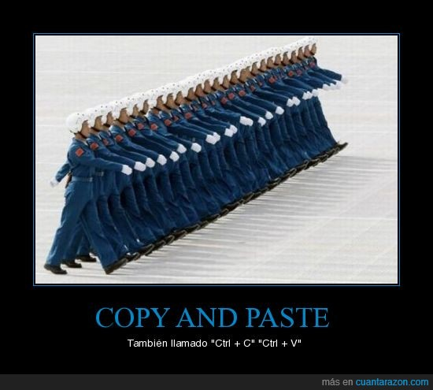
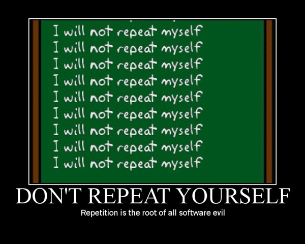
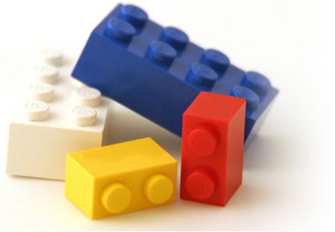

:title: 10 consejos para un mejor software (de) científico(s)
:data-transition-duration: 500
:css: slides.css

-----

:id: portada

*****************************************************************
      10 consejos para un mejor software (de) científico(s)
*****************************************************************

.. raw:: html

    
por Martín Gaitán

.. image:: img/twitter.png
   :align: center

--------

Quién soy
---------

- Compañero de Nati, Zamba y Minou
- Hincha de Boca y del dulce de leche
- Ingeniero en Computación (UNC)
- Pythonista desde 2007
- Emprendedor en @Phasety...
- ...Donde trabajo con científicos (químicos) que programan

.. image:: img/But-why-meme.png
   :align: center

---------

Sobre esta charla
-----------------

.. epigraph::

    De un hombre de software, a los hombres y mujeres
    de la academia, con respeto y cariño.

    -- yo

- A.K.A: catarsis | solidaridad | pedido de auxilio

----------

En general ¿qué hace el software (de) científico(s)?
----------------------------------------------------

- Herramienta de **exploración** de problemas
- Modelado numérico / simulación
- Manipulación de datos
- Gráficos

------

Problemas comunes
-----------------

- Ciclo prueba-error-corrección lento
- Documentación escasa
- Múltiples herramientas para lograr un resultado
- Limitaciones de scope del lenguaje ("no escala")
- Pirateo?
- Inercia académica

.. epigraph::

    No sigas las huellas de tus maestros.
    Busca lo que ellos buscaron.

    -- Matsuo Bashō

------

Consejo 1: Pare de sufrir
-------------------------

Use **Python** (y su stack científico)

.. note:: Python es una lenguaje versátil,
          interactivo, simple y documentado

-----

¿Les cobran por vocal?
----------------------

.. code-block:: fortran

   DIMENSION FUGx(2),FUGy(2),FUGTx(2),FUGTy(2),FUGVx(2),FUGVy(2)
   DIMENSION DFGNx(2,2),DFGNy(2,2)
   DIMENSION DPDNx(2),DPDNy(2),XOLD(5),OLD(5)

------

Consejo 2: programe para humanos
--------------------------------

Especialmente para Ud mismo, luego del fin de semana largo.

.. epigraph::

    Programs must be written for people to read, and only incidentally for machines to execute.

    -- Abelson & Sussman, Structure and Interpretation of Computer Programs

-----

.. code:: html

    From: Juan <subdito@todavianosegit.edu>
    To: Dr. God <sersuperior@todavianosegit.edu>
    Subject: Trabajo

    Doctor, acá le mando el zip con la última versión
    que incluye mi parte del paper

    ----

.. code:: html

    From: Dr. God <sersuperior@todavianosegit.edu>
    To: Juan <subdito@todavianosegit.edu>
    Subject: Re: Trabajo

    Estimado Juan me olvidé de avisarle que yo modifiqué esa parte
    y cambiaron los parámetros de la función.
    Por favor, revise el último código.

------

Consejo 3: use control de versiones
-----------------------------------

Aprenda `GIT <http://nyuccl.org/pages/GitTutorial/>`_

- Cambios incrementales
- Backup
- Trabajo **colaborativo**: qué, quién, cuándo (para qué)
- Branchs: libertad para experimentar
- Dropbox **no es una solución**

-----

Ay, los inputs!
---------------

.. code-block::

    1
    0 0
    CARBON DIOXIDE
    304.21  73.83  0.22362  0.114197
    3.7042  0.029682  0.823228
    ETHANE
    305.32  48.72  0.09949  0.173685
    5.6544  0.045144  0.634870
    0.0
    0.0
    200.0

--------

Consejo 3: Use estándares (abiertos)
------------------------------------

Por ejemplo **json** o YAML

.. epigraph::

    "Simple is better than complex.
     Explicit is better than implicit"

    -- The Zen of Python

--------

Efecto ``model2param.for``
---------------------------

---

Consejo 4: Don't Repeat Yourself
--------------------------------

-------

Bienvenidos a mi código científico
----------------------------------

------

Consejo 5: Modularizá
---------------------

------

Consejo No reinventes la rueda
------------------------------

Newton

0.
1. DRY & KISS
2. Versionado

http://nyuccl.org/pages/GitTutorial/

3. Lenguaje que facilite la programación exploratoria
4. API, programable/interactiva
5. I/O con formato estándar.
6. No hardcoded
7. Modularidad
8. Parámetros vs atributos (OOP)
9. Documentar
10. Usá Python

